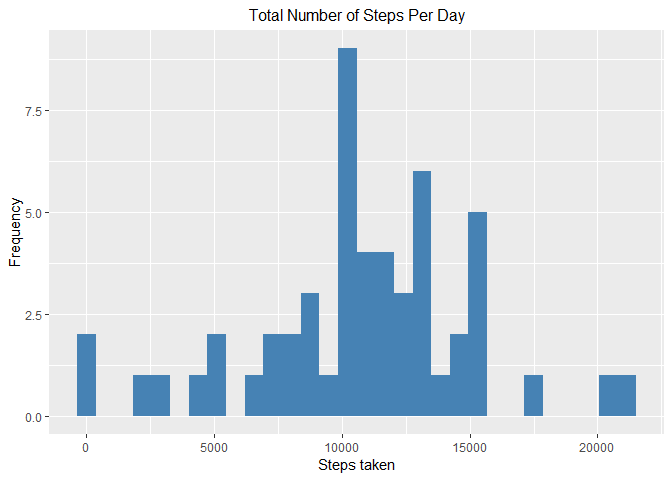
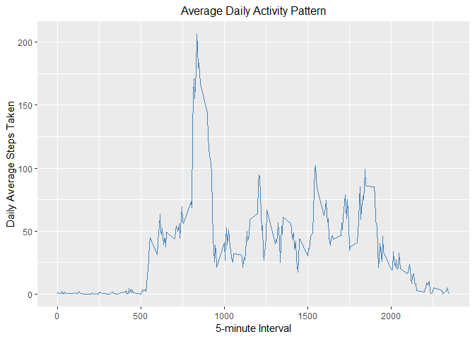
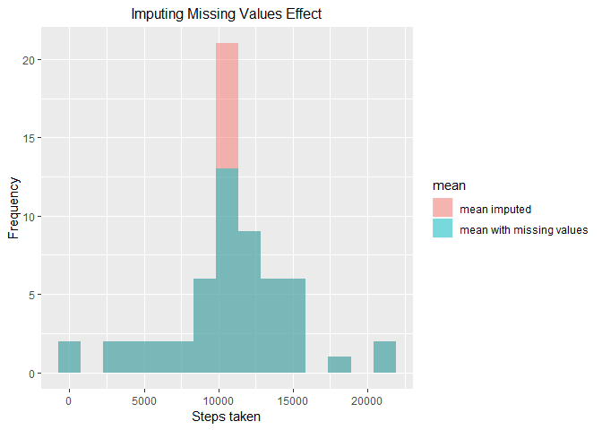
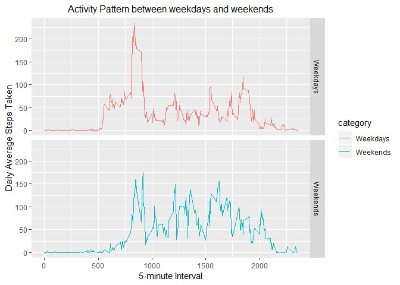

## Loading and preprocessing the data

```r
library(tidyverse)
library(ggplot2)
library(Hmisc)

# setting up data source url and working directory
# to store the downloaded datasets
url<-"https://d396qusza40orc.cloudfront.net/repdata%2Fdata%2Factivity.zip"
folder<-paste0(getwd(),"/", "Activity_data.zip")
download.file(url, folder, method = "libcurl")
unzip("Activity_data.zip", exdir = "Activity_data")
```
1. Load the data set

```r
# load data set into R
Activity_Data <- read.csv("./Activity_data/activity.csv")
```
2. Process/transform the data (if necessary) into a suitable format 

```r
# format the data set
Activity_Data$date <- as.Date(Activity_Data$date)

# Read the data set structure
glimpse(Activity_Data)
```

```
## Observations: 17,568
## Variables: 3
## $ steps    <int> NA, NA, NA, NA, NA, NA, NA, NA, NA, NA, NA, NA, NA, N...
## $ date     <date> 2012-10-01, 2012-10-01, 2012-10-01, 2012-10-01, 2012...
## $ interval <int> 0, 5, 10, 15, 20, 25, 30, 35, 40, 45, 50, 55, 100, 10...
```


## What is mean total number of steps taken per day?
1. Calculate the total number of steps taken per day


```r
# subset the data set to calculate the total steps taken daily
Activity_Data_daily <- Activity_Data %>%
        group_by(date) %>%
        summarise(steps = sum(steps))
```

2. Histogram of the total number of steps taken each day

```r
# plotting date set into histogram
ggplot(data = Activity_Data_daily, aes(x = steps)) +
        geom_histogram(fill = "steelblue", bin = 15) +
        ggtitle("Total Number of Steps Per Day") + 
        xlab("Steps taken") + ylab("Frequency") + 
        theme(plot.title = element_text(size = 12, hjust = 0.5))
```

<!-- -->

3. Calculate and report the mean and median of the total number of steps taken per day
+ Mean with NA values emoved

```r
mean(Activity_Data$steps, na.rm = TRUE)
```

```
## [1] 37.3826
```

+ Median with NA values removed

```r
median(Activity_Data$steps, na.rm = TRUE)
```

```
## [1] 0
```


## What is the average daily activity pattern?
1. Time series plot of the 5-minute interval (x-axis) and the average number of steps taken, averaged across all days (y-axis)

```r
Activity_Data_interval <- Activity_Data %>%
        group_by(interval) %>%
        summarise(mean = mean(steps, na.rm = TRUE))

ggplot(data = Activity_Data_interval, aes(x = interval, y = mean)) +
        geom_line(col = "steelblue") +
        ggtitle("Average Daily Activity Pattern") + 
        xlab("5-minute Interval") + ylab("Daily Average Steps Taken") + 
        theme(plot.title = element_text(size = 12, hjust = 0.5))
```

<!-- -->

2. 5-minute interval, on average across all the days in the dataset, that contains the maximum number of steps

```r
Activity_Data_interval[which.max(Activity_Data_interval$mean),]
```

```
## # A tibble: 1 x 2
##   interval  mean
##      <int> <dbl>
## 1      835  206.
```


## Imputing missing values
1. Calculate and report the total number of missing values in the dataset

```r
NA_list <- apply(is.na(Activity_Data), 2, which)
length(NA_list$steps)
```

```
## [1] 2304
```

```r
length(NA_list$date)
```

```
## [1] 0
```

```r
length(NA_list$interval)
```

```
## [1] 0
```

    All the missing values are from steps variable.

2. Devise a strategy for filling in all of the missing values in the dataset

    The missing values from steps variable will be replaced with mean of steps.


3. Create a new dataset that is equal to the original dataset but with the missing data filled in

```r
Activity_Data_imputed <- Activity_Data
Activity_Data_imputed$steps <- with(Activity_Data_imputed, impute(steps, mean))
```


4. Histogram of the total number of steps taken each day and calculation of the mean and median total number of steps taken per day

```r
# subset the data set to calculate the total steps taken daily
Activity_Data_imputed <- Activity_Data_imputed %>%
        group_by(date) %>%
        summarise(steps = sum(steps))

# plotting date set into histogram
ggplot(data = Activity_Data_daily, aes(x = steps)) +
        geom_histogram(fill = "steelblue", bin = 15) +
        ggtitle("Total Number of Steps Per Day") + 
        xlab("Steps taken") + ylab("Frequency") + 
        theme(plot.title = element_text(size = 12, hjust = 0.5))
```

<!-- -->

    The impact of imputing missing data on the estimates of the total daily number of steps
    

```r
# create comparison data set
mean1 <- data.frame(steps = Activity_Data_daily$steps)
mean1$mean <- 'mean with missing values'
mean2 <- data.frame(steps = Activity_Data_imputed$steps)
mean2$mean <- "mean imputed"

combined_data <- rbind(mean1, mean2)

# histogram plot
ggplot(combined_data, aes(x = steps, fill = mean)) + 
        geom_histogram(bins = 15, alpha = 0.5, position = "identity") +
        ggtitle("Imputing Missing Values Effect") + 
        xlab("Steps taken") + ylab("Frequency") + 
        theme(plot.title = element_text(size = 12, hjust = 0.5))
```

```
## Warning: Removed 8 rows containing non-finite values (stat_bin).
```

<!-- -->
        

## Are there differences in activity patterns between weekdays and weekends?

```r
# creating category of the day of the week
Activity_Data$day <- weekdays(Activity_Data$date)
Activity_Data$category <- ifelse(Activity_Data$day %in% c("Saturday", "Sunday"),
                                 "Weekends", "Weekdays")
Activity_Data_Categorized <- Activity_Data %>%
        group_by(interval, category) %>%
        summarise(mean = mean(steps, na.rm = TRUE))
```

    Observing the pattern
    

```r
ggplot(data = Activity_Data_Categorized, aes(x = interval, y = mean, color = category)) +
        geom_line() +
        facet_grid(category ~ .) +
        ggtitle("Activity Pattern between weekdays and weekends") + 
        xlab("5-minute Interval") + ylab("Daily Average Steps Taken") +
        theme(plot.title = element_text(size = 12, hjust = 0.5))
```

<!-- -->

